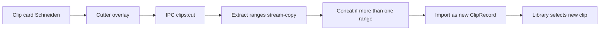

# Clip cutting tool

Clips already exist as files in the library (`[src/shared/clips-store.ts](src/shared/clips-store.ts)`). Capture still trims only “last N seconds” (`[trimLastNSeconds](src/shared/clip-service.ts)`). This feature is a **post-capture editor**: pick a clip, mark what to keep, FFmpeg writes a **new** file, original stays.




## User flow

- Each clip card gets a **Schneiden** button (disabled if the file is missing).
- Overlay (same pattern as `[DeleteClipDialog.tsx](src/renderer/src/components/DeleteClipDialog.tsx)`): in-app `<video>` preview, playhead, and a timeline of **keep-ranges**.
- Ranges can be added, removed, resized, and typed as times. Examples the UI must support:
  - one range: 60s starting at 3:20 in a 10m clip
  - two ranges: 0–30s plus last 90s
  - any non-overlapping set
- Shortcuts: set range start/end from playhead; “60s ab hier”; “erste 30s” / “letzte 90s”.
- **Als neuen Clip speichern** writes `{stem} (cut).mp4` next to the original (via existing `uniquePath`), imports it, selects it. Original is never deleted.

UI copy stays German, matching the rest of the app.

## FFmpeg (reuse existing stream-copy)

Generalize cutting in `[src/shared/clip-service.ts](src/shared/clip-service.ts)` so capture and the editor share one path:

- Probe duration with existing `getVideoDuration`.
- Validate ranges: `0 <= start < end <= duration`, no overlaps, at least one range, minimum ~0.2s each.
- Single range: `ffmpeg -y -ss START -i SRC -t DURATION -c copy -avoid_negative_ts make_zero DST` (same keyframe-aligned copy as today’s last-N trim).
- Multiple ranges: extract each segment to a temp dir, then concat demuxer (`-f concat -safe 0 -c copy`). Clean up temps in `finally`.
- `saveAndTrimClip` keeps its public API; internally it becomes one range of `[total-N, total]`.

Cuts snap to keyframes (same limitation as current 30s/1m/5m/10m clips). No re-encode.

## Serve video to the renderer

Thumbnails already use `thumb://`. Playback cannot use `file://` under the current CSP.

- Register a privileged `media` scheme (`stream: true`) next to `thumb` in `[src/main/index.ts](src/main/index.ts)`.
- `media://clip/{id}` streams the file via `net.fetch(pathToFileURL(...))`, forwarding `Range` so seeking works.
- Update CSP in `[src/renderer/index.html](src/renderer/index.html)`: `media-src 'self' media:;`.
- Attach `mediaUrl` in `withThumbUrls` (do not rely on raw `filePath` as a video `src`).

## IPC and store

New channel `clips:cut` in `[src/shared/ipc.ts](src/shared/ipc.ts)`, preload, and main:

```ts
cutClip(id: string, ranges: { start: number; end: number }[]): Promise<
  { ok: true; clip: ClipRecord } | { ok: false; error: string }
>
```

Main handler: resolve clip, call `cutClipToNewFile`, `ignorePathTemporarily` on the dest so the folder watcher does not double-import, then `importClipFromFile` + `sendClipsChanged`. Mutex so two cuts cannot run at once.

New clip: same year/month folder, `namedByUser: false`, new thumbnail. After success, App selects the new clip (same as after capture).

## UI pieces

- `[src/renderer/src/components/ClipCutter.tsx](src/renderer/src/components/ClipCutter.tsx)` — overlay, video, transport, range list, save/cancel.
- Small timeline: click to seek, drag range edges, highlight keep vs drop. Show total keep duration vs source duration.
- Wire **Schneiden** on `[RecentClips.tsx](src/renderer/src/components/RecentClips.tsx)` / `[App.tsx](src/renderer/src/App.tsx)`.
- Time helpers in `[format.ts](src/renderer/src/format.ts)` (`mm:ss` parse/format).

Window is already ~980×780; overlay uses most of that space. No new shadcn Dialog — match the existing custom overlay.

## Speicher tab

Replace the header dropdown (Bibliothek / Einstellungen) with three visible tabs so Storage is a first-class view: **Bibliothek**, **Speicher**, **Einstellungen**. `AppView` becomes `"library" | "storage" | "settings"`. Use the existing `ButtonGroup` + outline/default buttons in [`AppHeader.tsx`](src/renderer/src/components/AppHeader.tsx); clip-preset buttons stay on the library view only.

New [`StoragePanel.tsx`](src/renderer/src/components/StoragePanel.tsx) shows space for the disk that holds `CLIP_OUTPUT_DIR` (default `C:\Clips`):

- Drive / folder path
- Free vs total (e.g. “128 GB frei von 931 GB”) with a used/free bar
- Size of the clips folder itself (sum of files under the output dir)
- Refresh on open, a refresh button, and a light poll while the tab is visible

IPC `storage:get` in main, using Node `fs.promises.statfs(outputDir)` for volume totals and a bounded walk of the output dir for clips usage:

```ts
{
  outputDir: string;
  totalBytes: number;
  freeBytes: number;
  clipsBytes: number;
}
```

If the folder is missing or `statfs` fails, show a German error on the panel (do not crash). Format sizes in [`format.ts`](src/renderer/src/format.ts) (`12,4 GB`).

## Out of scope

- CLI `clip.bat` stays last-N-seconds capture.
- Replacing/deleting the original.
- Frame-accurate re-encode.
- README unless you want it updated after this ships.

