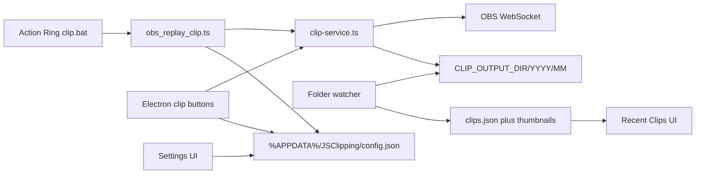

# Electron companion for JSClipping (TypeScript)

JSClipping stays a CLI clipper for the Action Ring. Electron is an always-on companion: OBS status, settings UI, clip buttons, and a Recent Clips list. **The whole app (CLI, shared services, Electron main/preload/renderer) is TypeScript.** Existing `.js` modules are converted, not left as a mixed JS/TS tree.



## Tooling

- **[electron-vite](https://electron-vite.org/)** for the desktop app: TypeScript for main, preload, and renderer, with a Vite-built renderer (vanilla TS, no React).
- **`typescript`** with `strict: true`, plus `@types/node`. Electron ships its own types.
- **`tsx`** for the Action Ring CLI so `clip.bat` does not need a compile step. Call the **local** binary (`node_modules\.bin\tsx`) so Options+ does not depend on a global install.
- Convert [`src/env.js`](src/env.js), [`src/log.js`](src/log.js), and [`src/obs_replay_clip.js`](src/obs_replay_clip.js) to `.ts` as part of this work.

Scripts in [`package.json`](package.json):

- `"dev": "electron-vite dev"` — Electron with HMR
- `"start": "electron-vite preview"` or `electron-vite dev` as the daily driver
- `"build": "electron-vite build"`
- CLI remains `scripts\clip.bat 30` → `tsx src/cli/obs_replay_clip.ts 30`

`contextIsolation: true`, `nodeIntegration: false`. Preload exposes a typed `window.api` via `contextBridge` (shared IPC types in `src/shared/ipc.ts`).

## Layout

```
electron.vite.config.ts
tsconfig.json
tsconfig.node.json
tsconfig.web.json
src/
  shared/
    config.ts
    clip-service.ts
    clips-store.ts
    thumbnail.ts
    log.ts
    ipc.ts              # IPC channel names + payload types
  cli/
    obs_replay_clip.ts  # Action Ring entry
  main/
    index.ts
  preload/
    index.ts
  renderer/
    index.html
    src/main.ts
    src/styles.css
```

## Config: AppData JSON, migrate `.env`

Replace dotenv as the source of truth with [`src/shared/config.ts`](src/shared/config.ts).

- Path: `%APPDATA%\JSClipping\config.json` (Electron: `app.getPath('userData')` after `app.setName('JSClipping')`; CLI: `process.env.APPDATA`).
- Shape: `{ OBS_URL, OBS_PASSWORD, CLIP_OUTPUT_DIR }` with the existing Zod checks from [`src/env.js`](src/env.js).
- First run: if AppData config is missing and repo `.env` exists, copy those values over, then use AppData going forward.
- Fallback: if neither exists, use the current `.env.example` defaults and let the UI fill in the password.
- [`src/cli/obs_replay_clip.ts`](src/cli/obs_replay_clip.ts) / [`scripts/clip.bat`](scripts/clip.bat) keep working, but they read the **same** AppData file the UI edits.

`.env` remains gitignored as a one-time migration source; README will point people at the in-app Settings panel.

## Extract shared clip logic

- [`src/shared/clip-service.ts`](src/shared/clip-service.ts) — `saveAndTrimClip({ obs, seconds, outputDir })`: `SaveReplayBuffer`, poll `GetLastReplayBufferReplay`, ffmpeg trim. Accept an existing OBS client so the Electron connection can be reused.
- Write the trimmed file to `{CLIP_OUTPUT_DIR}/{YYYY}/{MM}/` using the clip timestamp (`YYYY` 4-digit, `MM` zero-padded). Create those folders if missing. Default filename stays `{obsBasename}_{seconds}s.ext` until the user sets a title.
- CLI stays a thin wrapper (connect → clip → disconnect) for Action Ring.

## Electron behavior

**OBS status (main process):** persistent `obs-websocket-js` connection using current config. Connect on launch, listen for close/error, reconnect with backoff. Push `{ connected, error? }` to the renderer. Saving URL/password reconnects immediately.

**Clip buttons:** 30s / 1m / 5m / 10m in the window. Main process runs `clip-service` on the existing OBS socket. Action Ring / `clip.bat` is unchanged in purpose (only the Node entry becomes `tsx` + `.ts`).

**Folder watcher:** `chokidar` recursively on `CLIP_OUTPUT_DIR` (`**/*.{mp4,mkv,mov,webm}`). Debounce until file size is stable (ffmpeg still writing). On new file (from Action Ring **or** the UI): generate a thumbnail, append to the store, notify the UI. Ignore events caused by our own title-rename (`unlink` + `add` of the same clip id) so a rename does not create a duplicate recent-clip entry.

## Year/month folders and titles that rename files

Output layout:

```
C:\Clips\
  2026\
    08\
      Replay 2026-08-24 12-51-03_30s.mp4
      Insane clutch.mp4
    09\
      ...
```

- **New clips** always land in `{CLIP_OUTPUT_DIR}/{YYYY}/{MM}/` based on the clip’s created time, not “now” at rename time. Renaming a title does **not** move the file to a different month.
- **Existing clips** already sitting in the output root (or other subfolders) are imported on first scan. If they are not already under a `YYYY/MM` folder, move them into one derived from file mtime so the tree is consistent.
- **Setting a title** in the UI updates `clips.json` **and** renames the file on disk in the same folder: `{sanitizedTitle}{ext}`.
  - Strip Windows-illegal characters (`<>:"/\|?*`) and trailing dots/spaces.
  - If the sanitized name is empty, keep the current filename.
  - On collision, append ` (2)`, ` (3)`, …
  - Update `filePath` in the store after a successful `fs.rename`. Thumbnails stay in AppData keyed by clip id (no need to rename the jpg).
  - If the file is missing, keep the metadata name but surface “missing” — do not invent a new file.

## Recent clips

Store at `%APPDATA%\JSClipping\clips.json`:

- `id`, `filePath`, `name` (display name = current title / filename stem), `createdAt`, `durationSeconds`, `thumbnailPath`
- Thumbnails via ffmpeg (`-frames:v 1`) into `%APPDATA%\JSClipping\thumbnails\`
- On first launch, scan `CLIP_OUTPUT_DIR` recursively for existing videos, import any not already in the index, and move them into `YYYY/MM` as above
- Click opens with `shell.openPath` (system player / Explorer). No in-app playback
- If the file is gone, show it as missing rather than crashing

UI layout: header with connection pill, clip buttons, Settings (URL, password with show/hide, output folder picker via `dialog.showOpenDialog`), then a Recent Clips grid (thumbnail + name + length). Renderer is vanilla TypeScript DOM — no React.

## Docs and verification

Update [README.md](README.md): `npm run dev` for the Electron app, where config lives, that Action Ring still uses `clip.bat` (now via local `tsx`), and that settings are shared. Do not package an installer unless you ask later.

After implementation, run the Electron window and check: OBS connected/disconnected, save settings, clip from a button, file lands in `YYYY/MM`, Action Ring/CLI clip appears in Recent Clips, title change also renames the file, click-to-open still works after rename.
